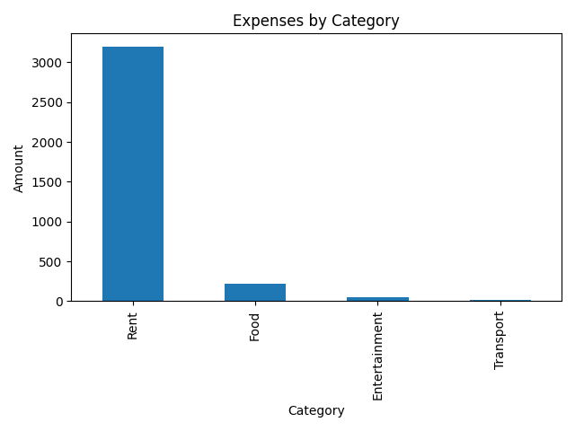
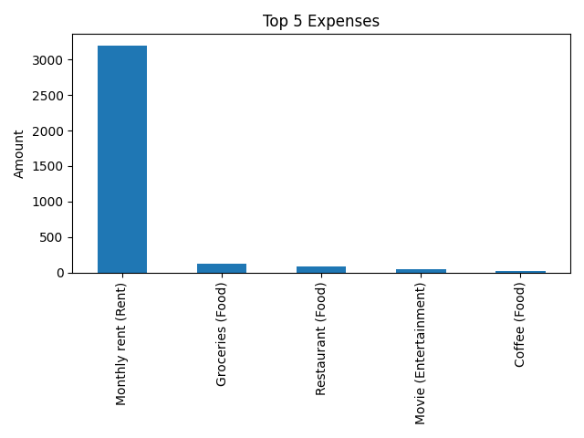

# Expense Tracker

A simple Python project for tracking personal expenses and analyzing spending patterns.

## Features

- Load expenses from a CSV file
- Calculate total expenses
- Breakdown by category
- Monthly summaries
- Basic visualizations

## Tech Stack

- Python
- Pandas
- Matplotlib

## Project Structure

- `src/` – application code
- `data/` – sample CSV data
- `docs/` – screenshots and documentation

## Roadmap

- [ ] Add expense categories
- [ ] Monthly analysis
- [ ] Visual charts

## Demo

